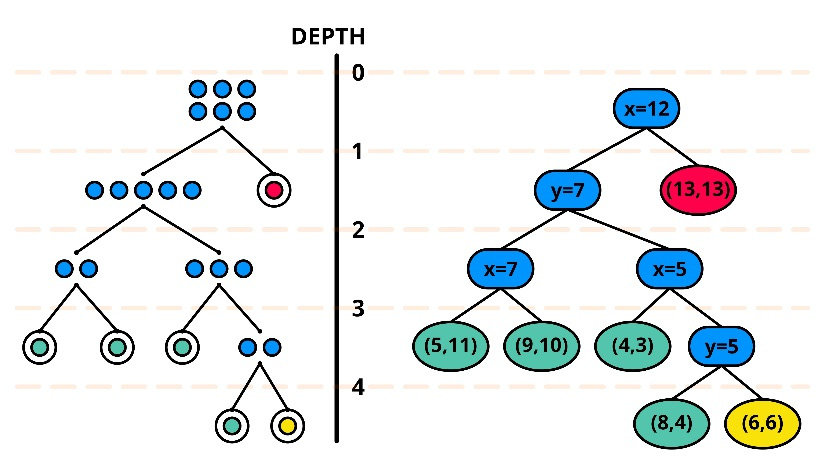

## Machine Learning in Automation

### Objectives
- Understand ML in an industrial context
    - What can it do?
    - Where does it make sense?
- Understand training and inference
    - Tools, technologies, roles & responsibilities

### Agenda
1. Context & Concepts (Presentation)
2. Tooling & Setup
    - Python + packages
        - [Python 3.10](https://www.python.org/ftp/python/3.10.11/python-3.10.11-amd64.exe)
		- Set `PATH` environment variable
        - `pip install pandas numpy scikit-learn onnx skl2onnx matplotlib onnxruntime`
    - TwinCAT requirements
        - TF3800 Machine Learning Runtime
		- TwinCAT Machine Learning Model Manager
3. Lab 1: Supervised learning
4. Lab 2: Unsupervised Learning

## Lab #1 - Supervised Learning

#### Visionless Quality Inspection
Customer problem statement:
>🧑‍🏭 "Currently, parts are inspected at regular intervals to ensure quality. This manual step is slow and inconsistent. We know there is a relationship between the in-process sensor data and the quality of a part, but we have not been able to substantiate it.
>
>The crucial part of the process takes roughly 250ms, and contains the following relevant signals:
>- Motor current
>- Vibration
>- Temperature
>- Cycle time
>
>Upon viewing and trending these signals, some relationships are obvious; e.g. higher temperatures cause volatility in the process. Similarly, increases in vibration and current *correlate* to lower quality parts, but do not reliably predict quality with any consistency. **We have tried implementing conditional logic, but it feels like we are chasing our tails!**"

#### Feature Extraction

The above metrics represent our data set, but they are not the only features we can extract.

> Example: **what's in a timestamp?**<br />
> A timestamp might look like this: *1778118721000* or this: *YYYY:MM:DD MM:HH:ss*<br />
> But what else does it tell us? DoW, DoM, ToD, age/recency vs NOW(), interval patterns like daily, weekly, monthly, per-shift, seasonal, etc... → features can be **derived** from the context of a value.

For our process data, what meaningful features can we extract? Simply using the raw signal data is one approach, but that's not always effective or optimal for models - especially ones we want to run in real-time. Usually, better relationships can be derived by applying *aggregate functions* or signal processing to the raw data. We don't have to go full condition monitoring with it, either – a lot can be gained from your basic STATS 101 formulas:
- Mean (the average)
- Range (the spread)
- Standard deviation (stability)
- Delta & Delta Idx (significant rates of change)
- Peaks/valleys (anomalies)

These derived values will give our machine learning model more data and more context on which to train and infer.

> **Note:** A typical workflow might have us capturing this raw signal data *first*, then apply these functions as a *post-processing* step; via database queries, from R or python scripts, etc...<br />
>We are going to do it right in the PLC. Why? Because:<br />
>a.) We will be inferencing right in the real-time<br />
>b.) We will need this *processed* data for the inference input<br />
>c.) We can (+1 more for PC-based controls 🙏)

### Data Acquisition
1. Create a structure to hold all the model's features:
```js
TYPE ST_Features :
STRUCT
	temp				: LREAL;
	cycle_time			: DINT;
	
	curr_mean			: LREAL;
	curr_peak			: LREAL;
	curr_range			: LREAL;
	curr_delta_max		: LREAL;
	curr_delta_idx		: LREAL;
	curr_std			: LREAL;
	                	
	vibe_mean			: LREAL;
	vibe_peak			: LREAL;
	vibe_range			: LREAL;
	vibe_delta_max		: LREAL;
	vibe_delta_idx		: LREAL;
	vibe_std			: LREAL;
END_STRUCT
END_TYPE
```
##### *Question: why no derived labels for temperature or cycle time?

2. To populate the feature structure, we will use this handy `FB_ALY_ArrayStatistics` block from the `Tc3_Analytics` library. It packages up all the aggregate functions we need:
```js
    /// declare user vars
	fbStatsCurrent		: FB_ALY_ArrayStatistics;
	fbStatsVibration	: FB_ALY_ArrayStatistics;
	stFeatures			: ST_Features;
```
```js
    /// init ALY FBs
	fbStatsCurrent.Configure(FALSE, 0.1, 0.1, 0);
	fbStatsVibration.Configure(FALSE, 0.1, 0.1, 0);
```
```js
	/// populate non-aggregate features
	stFeatures.temp := fTemperature;
	stFeatures.cycle_time := nCycleTime;
```
```js
    /// call ALY FBs
	fbStatsCurrent.Call(ADR(current_arr), SIZEOF(current_arr));
	fbStatsVibration.Call(ADR(vib_arr), SIZEOF(vib_arr));
	
	/// populate aggregate features
	IF fbStatsCurrent.bNewResult THEN
		stFeatures.curr_mean := fbStatsCurrent.fMean;
		stFeatures.curr_peak := fbStatsCurrent.fMax;
		stFeatures.curr_range := fbStatsCurrent.fMax - fbStatsCurrent.fMin;
		stFeatures.curr_delta_max := fbStatsCurrent.fMaxDelta;
		stFeatures.curr_delta_idx := fbStatsCurrent.nIdxMaxDelta;
		stFeatures.curr_std := fbStatsCurrent.fStandardDeviation;
	END_IF
	IF fbStatsVibration.bNewResult THEN
		stFeatures.vibe_mean := fbStatsVibration.fMean;
		stFeatures.vibe_peak := fbStatsVibration.fMax;
		stFeatures.vibe_range := fbStatsVibration.fMax - fbStatsVibration.fMin;
		stFeatures.vibe_delta_max := fbStatsVibration.fMaxDelta;
		stFeatures.vibe_delta_idx := fbStatsVibration.nIdxMaxDelta;
		stFeatures.vibe_std := fbStatsVibration.fStandardDeviation;
	END_IF
	
	/// generate CSV string
	IF fbStatsCurrent.bNewResult AND fbStatsVibration.bNewResult THEN
		sData := F_Feature_Csv(stFeatures);
	END_IF
```
The `F_Feature_Csv` function is just taking the feature structure and formatting it to a CSV string:
```js
FUNCTION F_Feature_Csv : STRING(512)
VAR_INPUT
	Features		: ST_Features;
END_VAR
```
```js
F_Feature_Csv := CONCAT(F_LRealToStr(Features.temp,  4), ',');
F_Feature_Csv := CONCAT(F_Feature_Csv, CONCAT(TO_STRING(Features.cycle_time), ','));

F_Feature_Csv := CONCAT(F_Feature_Csv, CONCAT(F_LRealToStr(Features.curr_mean,  4), ','));
F_Feature_Csv := CONCAT(F_Feature_Csv, CONCAT(F_LRealToStr(Features.curr_peak,  4), ','));
F_Feature_Csv := CONCAT(F_Feature_Csv, CONCAT(F_LRealToStr(Features.curr_range, 4), ','));
F_Feature_Csv := CONCAT(F_Feature_Csv, CONCAT(F_LRealToStr(Features.curr_delta_max, 4), ','));
F_Feature_Csv := CONCAT(F_Feature_Csv, CONCAT(TO_STRING(Features.curr_delta_idx), ','));
F_Feature_Csv := CONCAT(F_Feature_Csv, CONCAT(F_LRealToStr(Features.curr_std,  4), ','));

F_Feature_Csv := CONCAT(F_Feature_Csv, CONCAT(F_LRealToStr(Features.vibe_mean,  4), ','));
F_Feature_Csv := CONCAT(F_Feature_Csv, CONCAT(F_LRealToStr(Features.vibe_peak,  4), ','));
F_Feature_Csv := CONCAT(F_Feature_Csv, CONCAT(F_LRealToStr(Features.vibe_range, 4), ','));
F_Feature_Csv := CONCAT(F_Feature_Csv, CONCAT(F_LRealToStr(Features.vibe_delta_max, 4), ','));
F_Feature_Csv := CONCAT(F_Feature_Csv, CONCAT(TO_STRING(Features.vibe_delta_idx), ','));
F_Feature_Csv := CONCAT(F_Feature_Csv, CONCAT(F_LRealToStr(Features.vibe_std,  4), '$N'));
```


3. Let's collect some data. Ensure you have a valid path in the `sFilePath` variable. Copy the [headers.csv file](/data/headers.csv) into that path and rename it appropriately ("samples.csv"). Flip the `bEnableLogging` bit and verify that data is coming in:
```
temp,cycle_time,curr_mean,curr_peak,curr_range,curr_delta_max,curr_delta_idx,curr_std,vibe_mean,vibe_peak,vibe_range,vibe_delta_max,vibe_delta_idx,vibe_std
33.7999,228,8.4130,9.7077,4.8909,-1.2612,23.0,1.3170,1.9017,2.7450,1.7530,-1.4612,22.0,0.4821
33.7387,224,8.1583,9.5316,4.1955,1.0633,5.0,1.1701,1.9758,2.7215,1.4106,-0.9529,12.0,0.3460
...
```
We should be getting a fresh record every 1 second (cycle). In ML, usually more data = better, so let's let this cook for awhile 🧑‍🍳 while we talk about some concepts and terminology:

1. Supervised vs. unsupervised learning
    - We talked about **features**, now what are **labels**?
	- Supervised example: regression trees (this is what we will use for the lab)
2. Bias and variance - balancing model error
    - High Bias: underfit, oversimplified, too general
        - Need more features, increase complexity
        - "bias" - think "presumptuous"
    - High Variance: overfit, complex, noisy
        - Need more training data, reduce complexity
        - "variance" - between point-to-point relationships
3. Regression trees (Powerpoint)

### Training

Now we should have a reasonably-sized data set to work with. Step 1 will be **training**. Since we are using a *supervised* learning algorithm, first we need to apply **labels**. For the "manual" inspection, we will use the `manual_inspect.py` script to simulate an operator applying a score to each part in our data set.

Ideally you will be able to feed this script roughly 1000 samples. If you have more than that, trim the file and keep the excess for testing later on with our trained model. Make sure to keep all the appropriate headers intact when modifying CSVs.

Double-check your file names and paths, and run the script with `python .\manual_inspect.py`. You should get a histogram of the scoring distribution, and an output file `samples_manual_score.csv` with all the same data + a new column with the manual score between `0.0-1.0`. Let's perform some manual analysis of the data set in Excel. We can trend the score alongside some of the features and illustrate some of the correlations mentioned in the customer problem statement.

> Hint: The manual score most heavily correlates with vibration and current data. Not just the mean, peak, or max range, *but the point in the process at which each signal varies the most.* This is heavily influenced by temperatue and cycle time - but only when those conditions complement each other in certain ways. Think about the difficulty in capturing all of this effectively with conditional logic:
```js
// temp in threshold AND cycle time in threshold AND 
// difference between vibration AND current measurements are outside acceptable range...
if ((temp in temp_thresh_1) && !(temp in temp_thresh_2) && (cycles in cycle_thresh_1) || !(temp in temp_thresh_1) && (cycles in cycle_thresh_2))
	for (i in (cycles in cycle_thresh))
		if (abs(vib_data[i + 1] - vib_data[i]) > vib_delta_thresh) && 
			(abs(curr_data[i + 1] - curr_data[i]) > curr_delta_thresh)
				//...
```
...and this is still not guaranteed to produce results consistent with the "eyeball" test. This is what the customer meant by "chasing [their] tails" with regards to an algorithmic approach. These are examplary conditions for the *when to use it* question in regards to the application of machine learning models.

So, let's start building our regression trees from scratch! JK, the python tools package that up for us into nice 1- or 2-line function calls. Create a file `training.py`:

```python
import pandas as pd
import numpy as np
import matplotlib.pyplot as plt

from sklearn.model_selection import train_test_split
from sklearn.ensemble import GradientBoostingRegressor
from sklearn.metrics import mean_squared_error

from skl2onnx import convert_sklearn
from skl2onnx.common.data_types import FloatTensorType

# read in our labeled data
df = pd.read_csv("samples_manual_score.csv")

## feature list - *consistent order matters later...
features = [
    "temp",
    "cycle_time",
    "curr_mean",
    "curr_peak",
    "curr_range",
    "curr_delta_max",
    "curr_delta_idx",
    "curr_std",
    "vibe_mean",
    "vibe_peak",
    "vibe_range",
    "vibe_delta_max",
    "vibe_delta_idx",
    "vibe_std"
]

# X = features
X = df[features]

# Y = label
y = df["man_quality"]

# call training method
model = GradientBoostingRegressor(n_estimators=200, learning_rate=0.03, max_depth=3)
model.fit(X, y)

# print feature weights
fdf = pd.DataFrame([model.feature_importances_])
fdf.to_csv('feature_weights.csv', index=False, header=features)

# export to ONNX for TwinCAT
initial_type = [('float_input', FloatTensorType([None, len(features)]))]
onnx_model = convert_sklearn(model, initial_types=initial_type)
with open("model.onnx", "wb") as f:
    f.write(onnx_model.SerializeToString())

print("Model exported.")
```

Obviously, the magic is happening here:
```python
# call training method
model = GradientBoostingRegressor(n_estimators=200, learning_rate=0.03, max_depth=3)
model.fit(X, y)
```
For fine-tuning, we can look at all the parameter descriptions on [the scikit-learn site](https://scikit-learn.org/stable/modules/generated/sklearn.ensemble.GradientBoostingRegressor.html).

*Why* GradientBoostingRegressor?
- Handles non-linear relationships well
- Great for relational, tabular data – often outperforming neural networks
  - Especially for smaller data sets
- Good handling of mixed feature data without normalizing / scaling
- ONNX- / real-time-friendly (fast + deterministic)

Observe the file `feature_weights.csv` in Excel. These values were calculated in the training process as the relative contribution of each input feature toward predicting the target label. We should expect vibration points to be heavily weighted against the other labels.

Additionally, we should now have the trained model itself: `model.onnx`. We can feed this model novel feature inputs and receive an inferred value as output. We can actually view some information about our model by pointing it to the online tool [netron](https://netron.app/). There is not much to look at, but we should at least be able to see the *form* of our input & output (`x14 float` -> `x1 float`), the type (regressor), and some additional information.

> ONNX files contain:
>- The Computation Graph: A structured map of the model's architecture. It lays out the exact nodes, layers (e.g., Convolutional layers, Fully Connected layers), and the sequence of mathematical operations the data must pass through.
>- Learned Parameters & Weights: The numerical values learned during the training process. These are stored as mathematical matrices (Tensors) that dictate how inputs are transformed into predictions.
>- Metadata: Descriptive data about the model. This includes the ONNX version used, the author or tool that generated the model, data types, shapes of the inputs and outputs, and human-readable documentation.

### Inference

Before we implement the inference in our PLC, we can "sanity-check" it using the same python tools we used for development and training. The following script will run our training data set through the ONNX model to produce an inferred value for each record.

```python
import pandas as pd
import numpy as np
import onnxruntime as ort
import matplotlib.pyplot as plt

# load the onnx model for inference
sess = ort.InferenceSession("model.onnx")
input_name = sess.get_inputs()[0].name

# load manually tested data
df = pd.read_csv("samples_manual_score.csv")

# feature list - same order as training
features = [
    "temp",
    "cycle_time",
    "curr_mean",
    "curr_peak",
    "curr_range",
    "curr_delta_max",
    "curr_delta_idx",
    "curr_std",
    "vibe_mean",
    "vibe_peak",
    "vibe_range",
    "vibe_delta_max",
    "vibe_delta_idx",
    "vibe_std"
]

X = df[features].values.astype(np.float32)

# run inference
preds = sess.run(None, {input_name: X})[0]

# create new column 'onnx_pred'
df["onnx_pred"] = preds

# output inference to new file
df.to_csv("inferred.csv")

# plot manual / predicted comparison histogram
plt.hist(df["man_quality"], bins=20, alpha=0.5, label="manual")
plt.hist(df["onnx_pred"], bins=20, alpha=0.5, label="predicted")
plt.title("Quality Distribution")
plt.xlabel("Quality")
plt.ylabel("Count")
plt.legend(loc='upper left')
plt.show()
```

How does your model perform based on the scoring distributions? We can further analyze the results (e.g. in Excel) by comparing the `man_quality` and `onnx_pred` columns of our new `inferred.csv` file. If you have any extra data leftover that was *not* used for training, this would be a good opportunity to run it through both the manual inspection process and the inference to compare results (no need to re-train). If it looks decent (or not - this is all psuedo-random data), let's get our real-time inference running in TwinCAT.

Before wiring up the PLC code, we need to use the Model Manager to convert the ONNX file to a TwinCAT ML XML format.

1. From the menu bar: TwinCAT -> Machine Learning -> Machine Learning Model Manager
2. Select files -> point to your ONNX
3. Convert files -> Dialog should indicate compatibility and success
4. Open target path

>Fun fact: This Model Manager tool can also facilitate things like scaling input/output data or applying meta data to the model. It also has functions for automating this process via CLI or even python. That can be useful if you're continuously re-training and need to "hot-swap" the model at runtime!

You will see two XML files in the target path. One is the model itself, formatted for TwinCAT ML runtime consumption. The other (`_plcopen.xml`) contains the input and output data types the model FB will expect.

5. Import I/O data-types (DUTs -> Import PLCopenXML)
6. Copy the model XML file to your runtime path

Finally, for the PLC code. Some new declarations:
```js
	// machine learning declarations
	sOnnxPath			: STRING := 'C:\Temp\csv\model.xml';
	fbPredict  			: FB_MllPrediction;
	nInputDim 			: UDINT := 14;
	nOutputDim 			: UDINT := 1;
	fDataIn				: ST_modelInput;
	fDataOut 			: ST_modelOutput;
	
	hrErrorCode  		: HRESULT;
	bLoadModel   		: BOOL;
	nMlState       		: INT := 0;
```

A new case statement:
```js
CASE nMlState OF
    0: // idle state
		IF bLoadModel THEN
			bLoadModel := FALSE;
			nMlState := 10;
		END_IF
	10: // Config state
		// load model file & configure
		fbPredict.stPredictionParameter.MlModelFilepath := sOnnxPath;
		IF fbPredict.Configure() THEN // load model
			IF fbPredict.bError THEN
				nMlState := 999;
				hrErrorCode := fbPredict.hrErrorCode;
			ELSE // no error -> proceed to predict state
				nMlState := 20; 
			END_IF
		END_IF 
   20: // Predict state
		// format feature array input and call Predict
   		IF rtStart.Q THEN
			fDataIn := F_Feature_Array(stFeatures);
			fbPredict.Predict(
				pDataInp := ADR(fDataIn.in_float_input),
				nDataInpDim := nInputDim,
				fmtDataInpType := ETcMllDataType.E_MLLDT_FP32_REAL,
				pDataOut := ADR(fDataOut.out_variable),
				nDataOutDim := nOutputDim,
				fmtDataOutType := ETcMllDataType.E_MLLDT_FP32_REAL,
				nEngineId := 0,
				nConcurrencyId := 0);
		END_IF
         
		IF fbPredict.bError THEN // error handling
		 	nMlState := 999;
		 	hrErrorCode := fbPredict.hrErrorCode;         
		ELSIF bLoadModel THEN // load (updated) model
		 	bLoadModel := FALSE;
		 	nMlState := 10;
		END_IF;         
   999: // Error state
       // add error handling here       
END_CASE
```

The `F_Feature_Array` function simply loads our models input array from the `ST_Features` structure. Again, parameter *order* is important here:
```js
FUNCTION F_Feature_Array : ST_modelInput
VAR_INPUT
	Features 		: ST_Features;
END_VAR
```
```
F_Feature_Array.in_float_input[0, 0] := TO_REAL(Features.temp);
F_Feature_Array.in_float_input[0, 1] := TO_REAL(Features.cycle_time);

F_Feature_Array.in_float_input[0, 2] := TO_REAL(Features.curr_mean);
F_Feature_Array.in_float_input[0, 3] := TO_REAL(Features.curr_peak);
F_Feature_Array.in_float_input[0, 4] := TO_REAL(Features.curr_range);
F_Feature_Array.in_float_input[0, 5] := TO_REAL(Features.curr_delta_max);
F_Feature_Array.in_float_input[0, 6] := TO_REAL(Features.curr_delta_idx);
F_Feature_Array.in_float_input[0, 7] := TO_REAL(Features.curr_std);

F_Feature_Array.in_float_input[0, 8] := TO_REAL(Features.vibe_mean);
F_Feature_Array.in_float_input[0, 9] := TO_REAL(Features.vibe_peak);
F_Feature_Array.in_float_input[0, 10] := TO_REAL(Features.vibe_range);
F_Feature_Array.in_float_input[0, 11] := TO_REAL(Features.vibe_delta_max);
F_Feature_Array.in_float_input[0, 12] := TO_REAL(Features.vibe_delta_idx);
F_Feature_Array.in_float_input[0, 13] := TO_REAL(Features.vibe_std);
```

Upon activating and running, you just need to toggle the `bLoadModel` bool to initialize the inference. For each cycle, we now get a "score" in `fDataOut.out_variable[0, 0]`. Our customer can implement a simple check on the score, diverting parts under a certain threshold to manual inspection. They can continue to collect data and refine the model as the machine runs and the process evolves.

## Lab #2 - Unsupervised Learning

#### Predictive Maintenance

Assume we do *not* have the luxury of a manual inspection process for which we can derive a **labeled** dataset. We can still leverage ML via unsupervised learning. A model can be trained to detect "statistically unusual" behavior without having to know exactly **what** is going wrong.

That being said, we do still need data on which to train, and we need a known "good" state if we are to predict a "bad" one with a model.

Let's reuse our existing dataset, and this time assume that the customer supplied a batch of data from known "good" parts. We can effectively simulate this by ingesting the manually inspected data and filtering out cycles with a score below a certain threshold; say `0.85`.

Then, we will use the [Isolation Forest](https://scikit-learn.org/stable/modules/generated/sklearn.ensemble.IsolationForest.html) algorithm of the same scikit-learn python library for our machine learning model.

Load the manually scored dataset. Remember, we only use the score for filtering know "good" data:
```python
import pandas as pd
import numpy as np
import matplotlib.pyplot as plt

from sklearn.ensemble import IsolationForest

# load data
df = pd.read_csv("samples_manual_score.csv")
print("Loaded:", df.shape)

features = [
    "temp",
    "cycle_time",
    "curr_mean",
    "curr_peak",
    "curr_range",
    "curr_delta_max",
    "curr_delta_idx",
    "curr_std",
    "vibe_mean",
    "vibe_peak",
    "vibe_range",
    "vibe_delta_max",
    "vibe_delta_idx",
    "vibe_std"
]

X = df[features]

# simulate "known good" samples for training data
healthy_df = df[df["man_quality"] > 0.85]
print("Healthy samples:", healthy_df.shape)

X_healthy = healthy_df[features]
```
Train the model with the filtered data, then run the prediction on the whole dataset.
```python
# train isolation forest
model = IsolationForest(
    n_estimators=300,
    contamination=0.01,
    random_state=42
)

# train model on healthy data
model.fit(X_healthy)

print("Isolation Forest trained.")

# anomaly score
# higher = more normal
df["anomaly_score"] = model.decision_function(X)

# run prediction on full dataset
# +1 = normal
# -1 = anomaly
df["prediction"] = model.predict(X)

# quick stats
print("\nPrediction Counts:")
print(df["prediction"].value_counts())

# output results
df.to_csv("forest_out.csv", index=False)
corr = df["man_quality"].corr(df["anomaly_score"])
print(f"Correlation: {corr:.3f}")
```
Visualize results:
```python
# scatter plot manual quality vs anomaly score
plt.figure(figsize=(8, 6))

colors = df["prediction"].map({
    1: "blue",
    -1: "red"
})

plt.scatter(
    df["man_quality"],
    df["anomaly_score"],
    c=colors,
    alpha=0.6
)

plt.xlabel("Manual Quality Score")
plt.ylabel("Anomaly Score")
plt.title("Manual Quality vs Anomaly Detection")

plt.grid(True)
plt.show()
```

Upon running, your visualization will illustrate the manual quality score vs. the model's inferred "anomaly score" - which is then used to predict *normal* (blue) vs. *anomalous* (red) behavior. Ideally, you have a strong correlation between **high/low scores** and **normal/anomalous behavior** - which shows as clustering in the top right (blue) / bottom left (red).

#### Isolation Forests

***More Trees??*** Yes, an isolation forest similarly uses trees for inference, but in a much different way:
> Unlike with the (supervised) regressor trees, isolation forest trees are generated by randomly splitting or partitioning the datasets until points are isolated. By nature, outliers will be isolated in fewer partitions, and thus be shallower in the tree than "normal" data points:



#### source: [researchgate](https://www.researchgate.net/figure/Conceptual-illustration-of-isolation-forest-a-isolation-operations-of-data-points_fig3_353615159)

[And another good set of visualizations](https://medium.com/@y.s.yoon/isolation-forest-anomaly-detection-identify-outliers-101123a9ff63).

> A strong correlation is probable but not always guaranteed - remember with **unsupervised** learning, we do not use labeled data (our "manual score" field) at all in the training; *only* the process data. With this synthesized dataset (+ some trickery in the manual scoring algorithm to introduce complexity), high-quality results are not necessarily expected.

You can try tweaking the `man_quality` threshold and `IsolationForest()` params for a stronger correlation.

What can we do with this? In this case, executing the inference in-process might help us predict the health of the machine and react accordingly. Even with the model giving "false positives" the information is still valuable. For instance, we can look for *consecutive* anomalous cycles, and then adjust runtime parameters; reduce speed, wait for temperature stabilization, replace wear items, etc. **before** risking the production of bad parts.

### Bonus
Implement the unsupervised model within your PLC program.
> Note: Isolation Trees are **not** one of the TF3800 (real-time compatible) model types. Therefore, you will have to use either TF3820 Machine Learning Server, *or* find some other way (e.g. pyads).